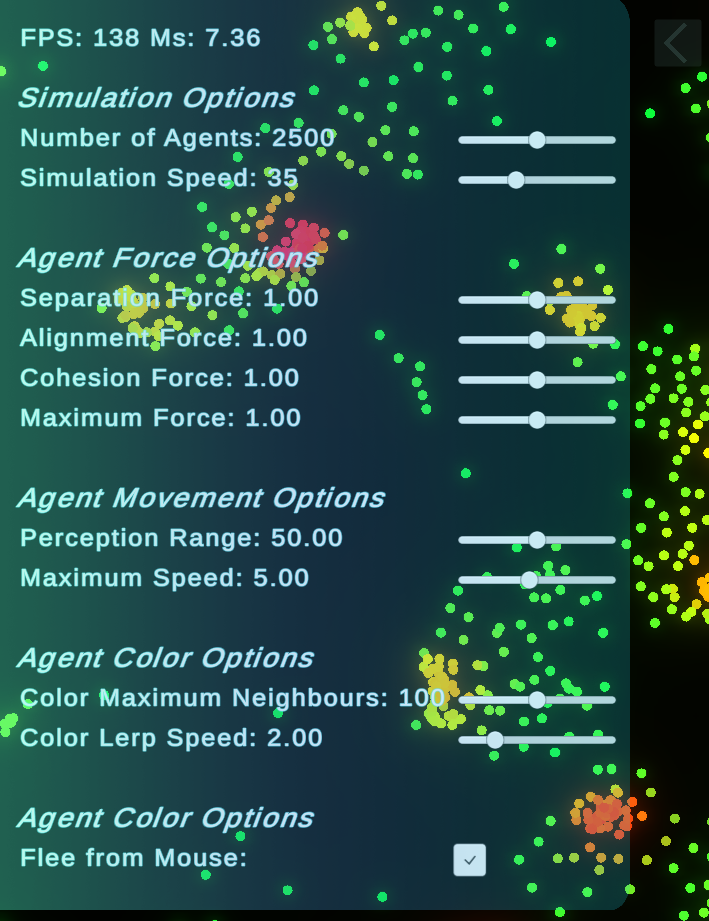

# Flocking Simulation - Unity2D
## Project Description
The project implements Craig Reynolds' flocking algorithm in 2D using Unity. The flocking behaviour emerges based on three simple rules of Cohesion, Separation and Alignment. To achieve high numbers of boid/agents the simulation is implemented using the Unity Jobs System and Burst compiler. This allows for simulation of up to 5000 agents at a fast frame rate.

## Usage Help
Feel free to fork this repo if you want to play around with the project. The project requires a version of Unity that supports the Urp, since the project utilises subtle postprocessing. Preferably version 2019.4 and up.

## Build of Project
A Windows build of the project is available here: https://drive.google.com/drive/folders/1KrUVjF-6JzGsgztfXrJIKfSkMdGKRFr1?usp=sharing

### Changing Simulation Settings
The Ui allows for easy alteration of the Simulation Parameters. 

The first set of settings allows you to change the number of boid being simulated and the overall project speed.

The second set of settings lets you change the forces acting on each boid. This includes the Separation, Alignment and Cohesion forces as well as the maximum force that is allowed to affect a boid each frame. For a great explanation of the boid force algorithm, check out the original paper by Craig Reynolds (https://www.red3d.com/cwr/boids/) as well as a great video explaining an implementation of the algorith here (https://www.youtube.com/watch?v=mhjuuHl6qHM).

The third set of settings allows for altering of boid movement parameters. The perception radius sets the maximum distance allowed between two boids, before they dont get considered in the force calculation. The maximum speed set boids speed. This speed parameter gets used in the force calculation algorithm. Therefore, it changes the boids behaviour rather than just adjusting the speed of the simulation.

The fourth settings category allows changes to the boids colour changing behaviour. Color Maximum Neighbours how many neighbours a boid need return the maximum evaluation value over the possible colour gradient. For example, if the gradient is set from red to blue, and the setting is set at 10, a boid's colour will be blue if it has 10 or more neighbours. The colour lerp value set how fast the boids colour shifts to the new colour being calculated.

The last settings tab allows you to have boids flee from the mouse pointer. This adds a small amount of interactivity to the simulation and is fun to play around with.

Feel free to download it and give it a try.

